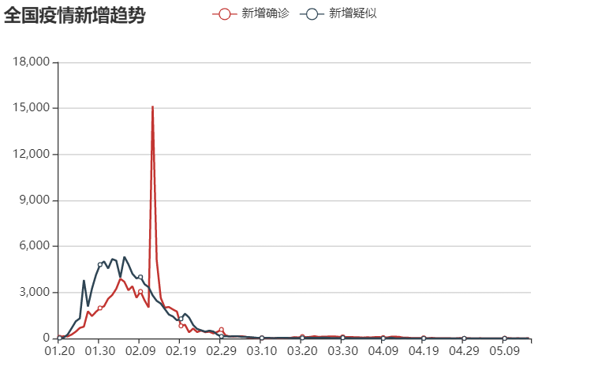
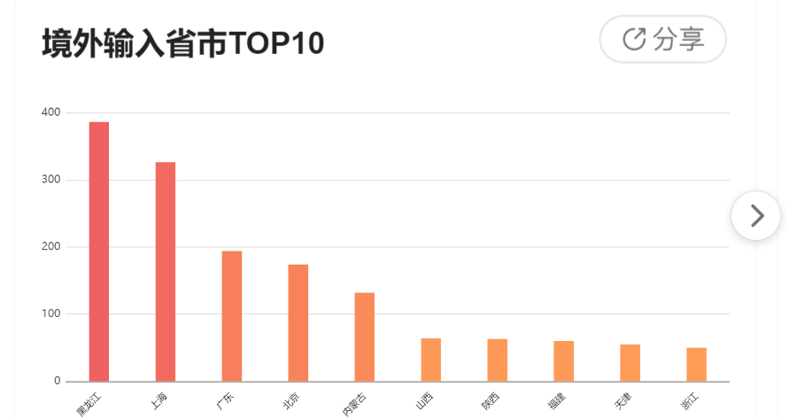
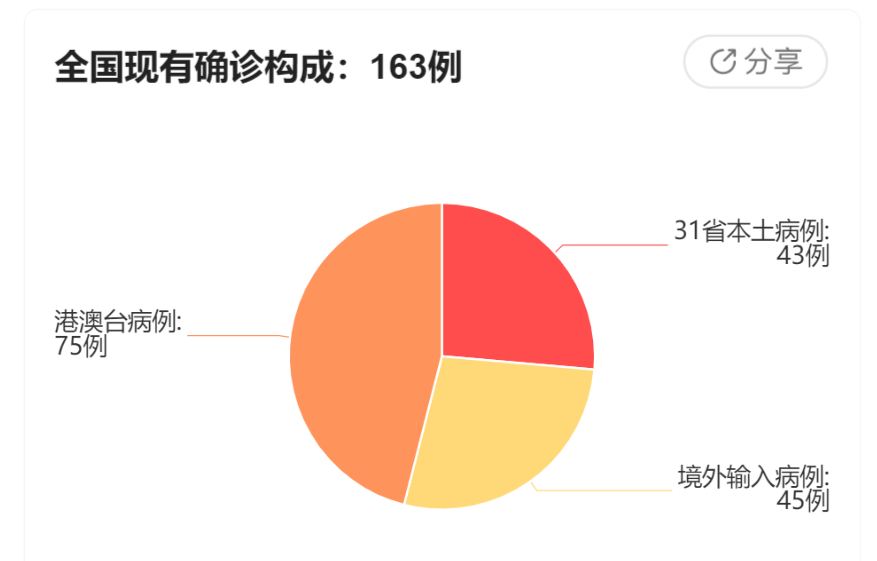

# SpringBoot项目
数据项目访问地址：http://118.190.27.19:8080/

折线图访问地址：<http://118.190.27.19:8080/graph>

多条折线图访问地址：<http://localhost:8080/graphAdd>

柱状图访问地址：<http://localhost:8080/graphColumnar>

地图访问地址：<http://localhost:8080/map>

## Day1

### 【课程目标】

1.SpringBoot的常见应用

2.业务功能的开发思路

3.爬虫的底层原理

4.对技术的应用有一定思考

### 【项目的诞生】

项目成员：项目经理 （PM）

产品经理PD、UI设计师UED、前端工程师FE、后端工程师RD

测试工程师QA、运维工程师OP


### 【功能的诞生】

产品经理->需求评审会 -> UI设计师（交互）- >  UI评审  -> 技术 -->  技术方案设计 ->  开发（1/3）->测试和修改


### 【爬虫的基础知识】

爬虫背景知识

“搜索引擎”是一种帮助用户搜索他们需要内容的计算机程序。

连接人与内容


存储数据的处理方式：

如：	一篇文章-》 语义分析 -》 关键字提取 -》根据关键字及出现次数等---》 倒排存储

关键字搜索：

【查询分析】 关键字相关的近义词、反义词、关联信息（IP、地址、用户信息）


爬虫分类：

通用型爬虫、垂直型爬虫（对特定内容的采集）


网站的首页作为种子、爬虫去采集能够分解出多少不重复的子连接，及其数据。

采集/下载页面  -》 分解为数据本身（存储）、新的链接（依次向下爬取，类似树的深度遍历）-》 直到没有新链接代表采集完成（链接使用队列来存储）

（三）爬虫数据的分析

1.浏览器开发者工具

分析数据源

1）腾讯新闻出品

<https://news.qq.com/zt2020/page/feiyan.htm#/?nojump=1>


工具的打开方式：F12/ctrl+shift+I/更多工具-开发者工具 / 右键-检查

选中Network-Preserve log（保存持续的日志），重新刷新页面，可以看到网页所有的请求连接和返回数据。


想拿到表格中 国内疫情的数据情况


分析的方式：
通过搜索框，搜索想要获得数据的具体数值，如：944、758等等

分析后的请求地址：

https://view.inews.qq.com/g2/getOnsInfo?name=disease_h5

返回数据的格式：json

2）丁香医生出品

<https://ncov.dxy.cn/ncovh5/view/pneumonia?from=timeline>

分析的方式如上：

分析后的请求地址：

https://ncov.dxy.cn/ncovh5/view/pneumonia?from=timeline

返回的数据格式是html


2、postman（模拟http请求的工具）

验证分析出来的请求地址，在排除上下文环境后，是否依然能够拿到数据。

比如有的请求，依赖cookie、依赖动态的参数等等


3、爬虫破解问题

拿到数据是核心的一步。

公开数据只要是非恶意就允许采集，非恶意是指模仿人的行为采集的行为，不会高并发或者恶意攻击。

隐私数据都是由强大的加密处理的，防爬虫的手段是安全领域内的一大问题。

## Day2

### 【解析数据】

#### （一）认识JSON

JSON = JavaScript Object Notation （JavaScript对象表示法）

本质上，是存储和交换文本信息的语法。是一种轻量级的文本数据格式。


java领域内解析json的工具：gson、fastjson、jackson


JSON和Java实体类

|    JSON     |           Java实体类           |
| :---------: | :----------------------------: |
|   string    |        java.lang.String        |
|   number    |   java.lang.Number（Double）   |
| true、false |       java.lang.Boolean        |
|    null     |              null              |
|    array    |  java.util.List（ArrayList）   |
|   object    | java.util.Map（LinkedTreeMap） |


#### （二）Gson

是google推出的，用来在json数据和java对象之间进行转换的类库。

```java
Gson gson = new Gson();
Gson gson1 = new GsonBuilder().create();

// 将对象obj转化为json字符串
String jsonStr = gson.toJson(obj);
// 将json字符串转化为java对象
T obj = gson.fromJson（jsonStr,class）;

```


使用方式：
1) 引入gson依赖

```
<dependency>
            <groupId>com.google.code.gson</groupId>
            <artifactId>gson</artifactId>
            <version>2.8.5</version>
</dependency>
```
 2） 解析文本数据

 ```java
public class DataHandler {

    public static String testStr = "{\"name\":\"zdefys科技\"}";


    public static List<DataBean> getData() throws Exception {
//        Gson gson = new Gson();
//        Gson gson1 = new GsonBuilder().create();
//        Map map = gson.fromJson(testStr, Map.class);
//        System.out.println(map);

        // 读取文件中的文本内容，然后再转化为java对象
//        File file = new File("tmp.txt");
        FileReader fr = new FileReader("tmp.txt");
        char[] cBuf = new char[1024];
        int cRead = 0;
        StringBuilder builder = new StringBuilder();
        while ((cRead = fr.read(cBuf)) > 0) {
            builder.append(new String(cBuf, 0, cRead));
        }
        fr.close();
//        System.out.println(builder.toString());
        Gson gson = new Gson();
        Map map = gson.fromJson(builder.toString(), Map.class);
//        System.out.println(map);
        ArrayList arrayList = (ArrayList) map.get("areaTree");
        Map dataMap = (Map) arrayList.get(0);
        ArrayList childrenList = (ArrayList) dataMap.get("children");

        // 遍历然后转化
        List<DataBean> result = new ArrayList<>(34);
        for (int i = 0; i < childrenList.size(); i++) {
            Map tmp = (Map) childrenList.get(i);
            // 区域名字
            String name = (String) tmp.get("name");
            Map totalMap = (Map) tmp.get("total");
            // 现有确认
            double nowConfirm = (Double) totalMap.get("nowConfirm");
            // 累计确诊
            double confirm = (Double) totalMap.get("confirm");
            // 治愈人数
            double heal = (Double) totalMap.get("heal");
            // 死亡人数
            double dead = (Double) totalMap.get("dead");

            DataBean dataBean = new DataBean(name,(int)nowConfirm,(int)confirm,(int)heal,(int)dead);
            result.add(dataBean);
        }

        return result;
    }
}
 ```


## Day3

#### （三） 将数据展示在页面中

1.编写service和controller

```java
public interface DataService {

    List<DataBean> list();
}
@Service
public class DataServiceImpl implements DataService {

    @Override
    public List<DataBean> list() {
        List<DataBean> result = null;
        try {
            result = DataHandler.getData();
        } catch (Exception e) {
            e.printStackTrace();
        }
        return result;
    }
}
@Controller
public class DataController {

    @Autowired
    DataService dataService;

    @GetMapping("/")
    public String list(Model model){
        List<DataBean> list = dataService.list();
        model.addAttribute("dataList", list);
        return "list";
    }

}

```

2.编写静态页面

```html
<!DOCTYPE html>
<html lang="en" xmlns:th="http://www.thymeleaf.org">
<head>
    <meta charset="UTF-8" >
    <title>Title</title>
</head>
<body>
    <h2>国内疫情情况如下</h2>

    <br>

    <table>
        <thead>
            <tr>
                <th>地区</th>
                <th>现有确诊</th>
                <th>累计确诊</th>
                <th>治愈</th>
                <th>死亡</th>
            </tr>
        </thead>
        <tbody>
        <tr th:each="data:${dataList}">
            <td th:text="${data.area}">name</td>
            <td th:text="${data.nowConfirm}">nowConfirm</td>
            <td th:text="${data.confirm}">confirm</td>
            <td th:text="${data.heal}">heal</td>
            <td th:text="${data.dead}">dead</td>
        </tr>
        </tbody>
    </table>
</body>
</html
```

#### (四) 转为实时数据

涉及知识点：用java代码模拟http请求

1、复习get和post请求

​	分别在使用场景、参数传递方式、数据大小限制、安全性等方面的异同。

2、HttpURLConnection

```
// 连接时间和读取时间
// 连接时间：发送请求端 连接到 url目标地址端的时间。
//          受到距离长短和网络速度的影响
// 读取时间：指连接成功后  获取数据的时间
//          受到数据量和服务器处理速度的影响
```

​	1） 通过创建url打开远程连接（HttpURLConnection）

​	2） 设置相应参数（超时时间和请求头）

​	3） 发送请求

​	4） 接收结果（使用InputStream和BufferedReader）

```java
public class HttpURLConnectionUtil {

        public static String doGet(String urlStr) {
            HttpURLConnection conn = null;
            InputStream is = null;
            BufferedReader br = null;
            StringBuilder result = new StringBuilder();
            try {
                URL url = new URL(urlStr);
                // 通过url打开一个远程连接 强转类型
                conn = (HttpURLConnection) url.openConnection();
                conn.setRequestMethod("GET");

                // 连接时间和读取时间
                // 连接时间：发送请求端 连接到 url目标地址端的时间。
                //          受到距离长短和网络速度的影响
                // 读取时间：指连接成功后  获取数据的时间
                //          受到数据量和服务器处理速度的影响
                conn.setConnectTimeout(15000);
                conn.setReadTimeout(60000);
                // 设定请求头参数的方式：如指定接收json数据  服务端的key值为content-type
                conn.setRequestProperty("Accept", "application/json");

                // 发送请求
                conn.connect();
                if (conn.getResponseCode() != 200) {
                    // TODO 此处应该增加异常处理
                    return "";
                }
                is = conn.getInputStream();
                br = new BufferedReader(new InputStreamReader(is, "UTF-8"));
                String line;
                // 逐行读取 不为空就继续
                while ((line = br.readLine()) != null) {
                    result.append(line);
                    System.out.println(line);
                }


            } catch (Exception e) {
                e.printStackTrace();
            } finally {
                try {
                    if (br != null) {
                        br.close();
                    }
                    if (is != null) {
                        is.close();
                    }

                } catch (IOException e) {
                    e.printStackTrace();
                }
            }

            return result.toString();
        }
```

## Day4

#### (五) 使用Jsoup解析html格式数据

1、Jsoup

​	是html的解析器，可以解析html文本和直接解析URL地址。

引入依赖

```
<!-- https://mvnrepository.com/artifact/org.jsoup/jsoup -->
<dependency>
    <groupId>org.jsoup</groupId>
    <artifactId>jsoup</artifactId>
    <version>1.13.1</version>
</dependency>

```

```java
//        Document document = Jsoup.parse(htmlStr);
        // 通过标签名找到元素
//        Elements element = document.getElementsByTag("p");
//        System.out.println(element);
        // 通过id找到元素
//        document.getElementById()
        // 通过正则表达式找到元素
//        Elements element = document.select("a[href]);

```

2、提供不同数据源的切换查询

1）增加了 controller方法

```java
@GetMapping("/list/{id}")
public String listById(Model model,@PathVariable String id){
    List<DataBean> list = dataService.listById(Integer.parseInt(id));
    model.addAttribute("dataList", list);
    return "list";
}
```

@PathVariavle 将接收到的地址数据，映射到方法的参数中

2） 完善service

```java
@Override
public List<DataBean> listById(int id) {
    if (id==2) {
        return JsoupHandler.getData();
    }
    return list();
}
```

3）处理数据的方法

```
public class JsoupHandler {

    // 丁香医生
    public static String urlStr = "https://ncov.dxy.cn/ncovh5/view/pneumonia?from=timeline";

    public ArrayList<DataBean>  getData() {
        ArrayList<DataBean> result = new ArrayList<>(34);

        try {
            Document doc = Jsoup.connect(urlStr).get();
//            Elements scripts = doc.select("script");
            // 找到指定的标签数据
            Element oneScript = doc.getElementById("getAreaStat");
            String data = oneScript.data();
            // 字符串截取出json格式的数据
            String subData = data.substring(data.indexOf("["), data.lastIndexOf("]") + 1);
            Gson gson = new Gson();

            ArrayList list = gson.fromJson(subData, ArrayList.class);
            for (int i = 0; i < list.size(); i++) {
                Map map = (Map) list.get(i);
                String name = (String) map.get("provinceName");
                double nowConfirm = (double) map.get("currentConfirmedCount");
                double confirm = (double) map.get("confirmedCount");
                double heal = (double) map.get("curedCount");
                double dead = (double) map.get("deadCount");

                DataBean dataBean = new DataBean(name,(int)nowConfirm,(int)confirm,(int)heal,(int)dead);
                result.add(dataBean);
            }

        } catch (Exception e) {
            e.printStackTrace();
        }
        return result;
    }
}
```


4）验证

分别访问http://localhost:8080/list/1 和http://localhost:8080/list/2

通过省份的名称来区分不同渠道的数据结果


#### (六)  增加数据存储逻辑

**1、引入相关的依赖**

```xml
<dependency>
    <groupId>org.mybatis.spring.boot</groupId>
    <artifactId>mybatis-spring-boot-starter</artifactId>
    <version>2.1.2</version>
</dependency>
<dependency>
    <groupId>com.baomidou</groupId>
    <artifactId>mybatis-plus-boot-starter</artifactId>
    <version>3.2.0</version>
</dependency>
<dependency>
    <groupId>mysql</groupId>
    <artifactId>mysql-connector-java</artifactId>
    <version>8.0.19</version>
</dependency>
```

**2、配置数据库**

```properties
spring.datasource.driver-class-name=com.mysql.cj.jdbc.Driver
spring.datasource.url=jdbc:mysql://118.190.27.19:3306/epidemic?serverTimezone=UTC&useUnicode=true&useSSL=false&characterEncoding=utf8
spring.datasource.username=root
spring.datasource.password=zdefys
```


**3、使用mybatis-plus进行增删改查的操作**

1）创建mapper

```java
public interface DataMapper extends BaseMapper<DataBean> {
}
```

2）扫描mapper的注解

```java
@MapperScan("com.zdefys.mapper")
```

3）创建service及其实现类

泛型是要处理的实体类

```java
public interface DataService extends IService<DataBean> {}
```

```java
@Service
public class DataServiceImpl extends ServiceImpl<DataMapper,DataBean> implements DataService {}
```

4）改造实体类Databean

此时要满足，存在无参构造器，以及可被序列化

同时指定具体映射的表名，通过@TableName

```java
@Data
@AllArgsConstructor
@NoArgsConstructor
@TableName("illness")
public class DataBean implements Serializable {

    /**
     * 区域名字
     */
    private String area;

    /**
     * 现有确诊
     */
    private int nowConfirm;

    /**
     * 累计确诊
     */
    private int confirm;

    /**
     * 治愈
     */
    private int heal;

    /**
     * 死亡
     */
    private int dead;
}
```


**4、初始化数据存储的逻辑**

@PostConstruct

修饰的方法，在服务器加载Servlet时运行，而且只执行一次

改造逻辑，首先将DataHandler声明为组件@Component

```
@Autowired
private DataService dataService;
@PostConstruct
public void saveData(){
    try {
        List<DataBean> dataBeans = getData();
        // 先将数据清空
        dataService.remove(null);
        dataService.saveBatch(dataBeans);
    }catch (Exception e){
        e.printStackTrace();
    }
}
```

@Scheduled

使用前需要在主程序入口类上打开开关

```java
@EnableScheduling
```


1） fixedRate = 10000 指定频率的执行任务 从方法执行开始就计时。

​	假设方法执行5s  那么第一次执行开始过了10s后，开始第二次执行

2） fixedDelay = 10000 指定间隔的执行任务  从方法执行完成开始计时

​	假设方法执行5s  那么第一次执行完成过了10s后，开始第二次执行

3）cron表达式—计划执行的表达式

​	<https://cron.qqe2.com/>

​	把6个位置用空格分隔，指代不同单位的时间，执行的规律

​	秒、分钟、小时、日期、月份、星期、（年，可选）

```java
// 配置定时执行的注解 支持cron表达式
// 每分钟执行一次
@Scheduled(cron = "0 0/1 * * * ?")
public void updateData(){
    System.out.println("更新数据");
    saveData();
}
```

## Day5

### 【展示数据】

  <https://echarts.apache.org/examples/zh/index.html>

是由百度前端技术部开发，基于js的数据可视化图表库


分析图形展示的数据来源，然后请求数据转换成我们需要的格式，传递给页面，通过Echarts渲染出来

#### （一）折线图


1）分析的请求地址

https://view.inews.qq.com/g2/getOnsInfo?name=disease_other

可以获得json格式的数据，数据的key是chinaDayList

2）模拟请求

HttpClient使用，应用最广泛的处理http请求的工具

引入maven依赖

```
<!-- https://mvnrepository.com/artifact/org.apache.httpcomponents/httpclient -->
<dependency>
    <groupId>org.apache.httpcomponents</groupId>
    <artifactId>httpclient</artifactId>
    <version>4.5.12</version>
</dependency>

```

```java
public class HttpClientUtil {

    public static String doGet(String urlStr) {

        // 提供了 闭合的HttpClient对象
        CloseableHttpClient httpClient = null;
        // 也提供了闭合的响应对象
        CloseableHttpResponse response = null;

        String result = null;
        try {

            // 使用默认创建方式
            httpClient = HttpClients.createDefault();
            // 创建一个get请求  传入url
            HttpGet httpGet = new HttpGet(urlStr);
            // 设置请求头的方式
            httpGet.addHeader("Accept", "application/json");
            // 设置请求参数   设定连接时间、数据读取时间（socketTimeOut）等  单位是毫秒
            // ConnectionRequestTimeout 指从共享连接池中取出连接的超时时间
            RequestConfig requestConfig = RequestConfig.custom()
                    .setConnectTimeout(35000)
                    .setConnectionRequestTimeout(35000)
                    .setSocketTimeout(60000).build();
            // 设置配置参数
            httpGet.setConfig(requestConfig);
            // 执行请求
            response = httpClient.execute(httpGet);
            // 从返回对象中获取返回对象
            HttpEntity entity = response.getEntity();
            result = EntityUtils.toString(entity);
        } catch (Exception e) {
            e.printStackTrace();
        }
        return result;
    }

    public static void main(String[] args) {
        String str = "https://view.inews.qq.com/g2/getOnsInfo?name=disease_other";
        String result = doGet(str);
        System.out.println(result);
    }
}

```


3）解析出数据

```java
public static String urlStr = "https://view.inews.qq.com/g2/getOnsInfo?name=disease_other";

    /**
     *  一条折线图
     *
     * @return
     */
    public static List<GraphBean> getGraphData() {

        List<GraphBean> result = new ArrayList<>(121);

        String str = HttpClientUtil.doGet(urlStr);
        Gson gson = new Gson();
        Map map = gson.fromJson(str, Map.class);
        String subStr = (String) map.get("data");
        Map subMap = gson.fromJson(subStr, Map.class);

        ArrayList list = (ArrayList) subMap.get("chinaDayList");
        for (int i = 0; i < list.size(); i++) {
            Map tmp = (Map) list.get(i);
            String date = (String) tmp.get("date");
            double nowConfirm = (double) tmp.get("nowConfirm");
            GraphBean graphBean = new GraphBean(date, (int) nowConfirm);
            result.add(graphBean);
        }
        return result;
    }

    public static void main(String[] args) {
        List<GraphBean> graphData = getGraphData();
        System.out.println(graphData);
    }
```

数据结构

```java
@Data
@NoArgsConstructor
@AllArgsConstructor
public class GraphBean {

    private String date;
    private int nowConfirm;
}
```


4）返回给页面渲染

控制类

```java
 @GetMapping("/graph")
    public String graph(Model model){
        List<GraphBean> list = GraphHandler.getGraphData();
        // 进一步改造数据格式
        // 因为前端需要的数据是 x轴所有数据的数据和y轴所有数据的数组
        ArrayList<String> dateList = new ArrayList<>(121);
        ArrayList<Integer> nowConfirmList = new ArrayList<>(121);
        for (int i = 0; i < list.size(); i++) {
            GraphBean graphBean = list.get(i);
            dateList.add(graphBean.getDate());
            nowConfirmList.add(graphBean.getNowConfirm());
        }
        model.addAttribute("dateList", new Gson().toJson(dateList));
        model.addAttribute("nowConfirmList", new Gson().toJson(nowConfirmList));
        return "graph";
    }
```

HTML

```html
<!DOCTYPE html>
<html lang="en" xmlns:th="http://www.thymeleaf.org">
<head>
    <meta charset="UTF-8">
    <title>Title</title>
    <script type="text/javascript" th:src="@{/echarts/echarts.min.js}"></script>
</head>
<body>
<!-- 为 ECharts 准备一个具备大小（宽高）的 DOM -->
<div id="main" style="width: 600px;height:400px;"></div>
</body>
<script th:inline="javascript">
    // 基于准备好的dom，初始化echarts实例
    var myChart = echarts.init(document.getElementById('main'));
    var dateStr = [[${dateList}]];
    var nowConfirmStr = [[${nowConfirmList}]];
    // 指定图表的配置项和数据
    var option = {
        title: { // 标题组件
            text: '全国现有确诊趋势'
        },
        tooltip: { // 提示框组件
            trigger: 'axis'
        },
        legend: { // 曲线含义说明
            data: ['现有确诊']
        },
        xAxis: { // 转化为json对象
            data: JSON.parse(dateStr)
            // data: dateStr
        },
        yAxis: {
            type: 'value'
        },
        series: [{
            name: '现有确诊',
            data: JSON.parse(nowConfirmStr),
            // data: nowConfirmStr,
            type: 'line'
        }]
    };

    // 使用刚指定的配置项和数据显示图表。
    myChart.setOption(option);
</script>
</html>
```

Echarts教程地址：[教程地址](https://echarts.apache.org/zh/tutorial.html#5%20%E5%88%86%E9%92%9F%E4%B8%8A%E6%89%8B%20ECharts)

准备dom-> 通过js渲染数据->使用[[$变量]]接收服务端数据–>使用JSON.parse(变量),解析json字符串，获得渲染结果。

## Day6

#### （二）折线图2



相关逻辑在GraphAddBean对应的代码中

处理数据-> 转化格式->返回数据给Echarts渲染

GraphHandler   DataController  *.html

```java
/**
     * 两条折线图
     *
     * @return
     */
    public static List<GraphAddBean> getGraphAddData() {
        List<GraphAddBean> result = new ArrayList<>(121);

        String str = HttpClientUtil.doGet(urlStr);
        Gson gson = new Gson();
        Map map = gson.fromJson(str, Map.class);
        String subStr = (String) map.get("data");
        Map subMap = gson.fromJson(subStr, Map.class);

        ArrayList list = (ArrayList) subMap.get("chinaDayAddList");
        for (int i = 0; i < list.size(); i++) {
            Map tmp = (Map) list.get(i);
            String date = (String) tmp.get("date");
            double addConfirm = (double) tmp.get("confirm");
            double addSuspect = (double) tmp.get("suspect");
            GraphAddBean graphAddBean = new GraphAddBean(date, (int) addConfirm, (int) addSuspect);
            result.add(graphAddBean);
        }
        return result;

    }
```


```java
@GetMapping("/graphAdd")
    public String graphAdd(Model model){
        List<GraphAddBean> list = GraphHandler.getGraphAddData();
        // 进一步改造数据格式
        // 因为前端需要的数据是 x轴所有数据的数据和y轴所有数据的数组
        ArrayList<String> dateList = new ArrayList<>(121);
        ArrayList<Integer> addConfirmList = new ArrayList<>(121);
        ArrayList<Integer> addSuspectList = new ArrayList<>(121);
        for (int i = 0; i < list.size(); i++) {
            GraphAddBean graphAddBean = list.get(i);
            dateList.add(graphAddBean.getDate());
            addConfirmList.add(graphAddBean.getAddConfirm());
            addSuspectList.add(graphAddBean.getAddSuspect());
        }
        model.addAttribute("dateList", new Gson().toJson(dateList));
        model.addAttribute("addConfirmList", new Gson().toJson(addConfirmList));
        model.addAttribute("addSuspectList", new Gson().toJson(addSuspectList));
        return "graphAdd";
    }
```

3）HTML

增加折线时，主要在legend和series中增加对应元素

```html
<!DOCTYPE html>
<html lang="en" xmlns:th="http://www.thymeleaf.org">
<head>
    <meta charset="UTF-8">
    <title>ZDEFYS出品：疫情最新动态</title>
    <script type="text/javascript" th:src="@{/echarts/echarts.min.js}"></script>
</head>
<body>
<!-- 为 ECharts 准备一个具备大小（宽高）的 DOM -->
<div id="main" style="width: 600px;height:400px;"></div>
</body>
<script th:inline="javascript">
    // 基于准备好的dom，初始化echarts实例
    var myChart = echarts.init(document.getElementById('main'));
    var dateStr = [[${dateList}]];
    var addConfirmList = [[${addConfirmList}]];
    var addSuspectList = [[${addSuspectList}]];
    // 指定图表的配置项和数据
    var option = {
        title: { // 标题组件
            text: '全国疫情新增趋势'
        },
        tooltip: { // 提示框组件
            trigger: 'axis'
        },
        legend: { // 曲线含义说明
            data: ['新增确诊','新增疑似']
        },
        xAxis: { // 转化为json对象
            data: JSON.parse(dateStr)
            // data: dateStr
        },
        yAxis: {
            type: 'value'
        },
        series: [{
            name: '新增确诊',
            data: JSON.parse(addConfirmList),
            type: 'line'
        },{
            name: '新增疑似',
            data: JSON.parse(addSuspectList),
            type: 'line'
        }]
    };

    // 使用刚指定的配置项和数据显示图表。
    myChart.setOption(option);
</script>
</html>
```


#### （三）柱状图



先分析数据的来源->  经过对数据的处理和计算–发送给前端组件进行渲染

相关逻辑在GraphColumnarBean对应的代码中

1）GraphHandler

```java
/**
     * 柱状图
     *
     * @return
     */
    public static List<GraphColumnarBean> getGraphColumnarData() {
        List<GraphColumnarBean> result = new ArrayList<>(26);
        String respJson = HttpClientUtil.doGet(urlStrAll);
        Gson gson = new Gson();
        Map map = gson.fromJson(respJson, Map.class);
        String subStr = (String) map.get("data");
        Map subMap = gson.fromJson(subStr, Map.class);
        ArrayList areaList = (ArrayList) subMap.get("areaTree");
        Map dataMap = (Map) areaList.get(0);
        ArrayList childrenList = (ArrayList) dataMap.get("children");

        for (int i = 0; i < childrenList.size(); i++) {
            Map tmp = (Map) childrenList.get(i);
            String name = (String) tmp.get("name");
            ArrayList children = (ArrayList) tmp.get("children");
            for (int j = 0; j < children.size(); j++) {
                Map subTmp = (Map) children.get(j);
                if ("境外输入".equals((String) subTmp.get("name"))) {
                    Map total = (Map) subTmp.get("total");
                    // 境外输入的数据
                    double fromAbroad = (double) total.get("confirm");

                    GraphColumnarBean bean = new GraphColumnarBean(name, (int) fromAbroad);
                    result.add(bean);
                }
            }
        }
        return result;
    }
```

2）DataController

```java
@GetMapping("/graphColumnar")
    public String graphColumnar(Model model) {
        List<GraphColumnarBean> list = GraphHandler.getGraphColumnarData();
        Collections.sort(list);
        ArrayList<String> nameList = new ArrayList<>(10);
        ArrayList<Integer> fromAbroadList = new ArrayList<>(10);
        for (int i = 0; i < 10; i++) {
            GraphColumnarBean bean = list.get(i);
            nameList.add(bean.getArea());
            fromAbroadList.add(bean.getFromAbroad());
        }
        model.addAttribute("nameList", new Gson().toJson(nameList));
        model.addAttribute("fromAbroadList", new Gson().toJson(fromAbroadList));
        return "graphColumnar";
    }
```

3） HTML

```html
<!DOCTYPE html>
<html lang="en" xmlns:th="http://www.thymeleaf.org">
<head>
    <meta charset="UTF-8">
    <title>ZDEFYS出品：疫情最新动态</title>
    <script type="text/javascript" th:src="@{/echarts/echarts.min.js}"></script>
</head>
<body>
<!-- 为 ECharts 准备一个具备大小（宽高）的 DOM -->
<div id="main" style="width: 600px;height:400px;"></div>
</body>
<script th:inline="javascript">
    // 基于准备好的dom，初始化echarts实例
    var myChart = echarts.init(document.getElementById('main'));
    var nameStr = [[${nameList}]];
    var fromAbroadStr = [[${fromAbroadList}]];
    // 指定图表的配置项和数据
    var option = {
        title: { // 标题组件
            text: '境外输入省市TOP10'
        },
        tooltip: { // 提示框组件
            trigger: 'axis'
        },
        xAxis: { // 转化为json对象
            data: JSON.parse(nameStr)
            // data: dateStr
        },
        yAxis: {
            type: 'value'
        },
        series: [{
            name: '境外输入',
            data: JSON.parse(fromAbroadStr),
            type: 'bar',
            barWidth: '60%',
        }]
    };

    // 使用刚指定的配置项和数据显示图表。
    myChart.setOption(option);
</script>
</html>
```


#### （四）饼状图



相关逻辑在GraphPieBean对应的代码中

GraphPie.html

```
// 指定图表的配置项和数据
    var option = {
        title: { // 标题组件
            text: '全国现有确诊构成：' + total + '例'
        },
        tooltip: { // 提示框组件
            trigger: 'axis'
        },
        series: [
            {
                type: 'pie',
                radius: '55%',
                center: ['50%', '60%'],
                data: JSON.parse(str)
            }
        ]
    };
```


## Day7

#### （五）中国地图

```html
<!DOCTYPE html>
<html lang="en" xmlns:th="http://www.thymeleaf.org">
<head>
    <meta charset="UTF-8">
    <title>ZDEFYS出品：疫情最新动态</title>
    <script type="text/javascript" th:src="@{/echarts/echarts.min.js}"></script>
    <script type="text/javascript" th:src="@{/echarts/china.js}"></script>
</head>
<body>
<!-- 为 ECharts 准备一个具备大小（宽高）的 DOM -->
<div id="main" style="width: 600px;height:400px;"></div>
</body>
<script th:inline="javascript">
    // 基于准备好的dom，初始化echarts实例
    var myChart = echarts.init(document.getElementById('main'));
    var mapDataStr = [[${mapData}]];
    // 指定图表的配置项和数据
    var option = {
        title: { // 标题组件
            text: '疫情地图',
            subtext: '仅供参考',
            x: 'center'
        },
        tooltip: { // 提示框组件
            trigger: 'item'
        },
        series: [
            {
                name: '现存确诊',
                type: 'map',
                mapType: 'china',
                roam: false,
                label: {
                    normal: {
                        position: 'center',
                        show: true,
                        textStyle: {
                            color: 'rgba(0,0,0,0,4)'
                        }
                    },
                    emphasis: {
                        show: true
                    }
                },
                data: JSON.parse(mapDataStr)
            }
        ]
    };

    // 使用刚指定的配置项和数据显示图表。
    myChart.setOption(option);
</script>
</html>
```

#### 【国际化】

##### （一）使用浏览器识别语种

是对thymeleaf中消息表达式的一种应用，#{}，提供的是对配置文件中信息的读取。

1）在resources目录下，创建i18n文件夹。

设置其中的key和value（注意：此时的编码格式需要在idea的设置中确认）

```properties
list.title=ZDEFYS出品：疫情最新动态 -D
list.h2=国内疫情情况如下 -D
list.table.name1=地区 -D
list.table.name2=现有确诊 -D
list.table.name3=累计确诊 -D
list.table.name4=治愈 -D
list.table.name5=死亡 -D
```

2）创建其他语种对应的配置文件，如*en_US.properties和*zh_CN.properteis

```properties
list.title=Illness New Dynamic State From ZDEFYS
list.h2=As Follows
list.table.name1=Area
list.table.name2=NowConfirm
list.table.name3=Confirm
list.table.name4=Heal
list.table.name5=Dead
```

3）在html中更改对key值的引用方式，使用消息表达式

```html
<title th:text="#{list.title}">ZDEFYS出品：疫情最新动态</title>
<h2 th:text="#{list.h2}">国内疫情情况如下</h2>
```

4）让spring找到国际化文件对应的位置，在application.properties中配置

```proper
spring.messages.basename=i18n.list
```

5）验证方式

通过更改浏览器中【设置】 - 【高级】 - 【语言】 - 找到【英语（美国）】，可以切换中英文显示

##### （二）自定义切换语种

使用spring提供的国际化使用类LocalResolver

1）页面中增加按钮

```html
 <label>
        <a class="btn btn-sm" th:href="@{/(lan='zh_CN')}">中文</a>
        <a class="btn btn-sm" th:href="@{/(lan='en_US')}">英文</a>
    </label>
```

2）自定义LocaleResolver的实现类

```java
public class MyLocaleResolver implements LocaleResolver {

    @Override
    public Locale resolveLocale(HttpServletRequest httpServletRequest) {
        String lan = httpServletRequest.getParameter("lan");
        Locale locale = Locale.getDefault();
        if (!StringUtils.isEmpty(lan)) {
            String[] split = lan.split("_");
            locale = new Locale(split[0], split[1]);
        }
        return locale;
    }

    @Override
    public void setLocale(HttpServletRequest httpServletRequest, HttpServletResponse httpServletResponse, Locale locale) {

    }
}
```

3）注入到Spring中

```java
@Configuration
public class MyConfig {

    @Bean
    public LocaleResolver localeResolver() {
        return new MyLocaleResolver();
    }
}
```

4）验证 此时切换按钮时，可以看到不同语种的显示

## Day8

#### （一）邮件

邮件发送的流程


引入maven依赖

```xml-dtd
<!-- 邮件 -->
<dependency>
    <groupId>javax.mail</groupId>
    <artifactId>mail</artifactId>
    <version>1.4.7</version>
</dependency>
```

【协议】

SMTP = Simple Mail Transfer Protocol  简单邮件传输协议

在邮件发送时，主要会使用到的协议，服务器地址形如：smtp.***.com


如果从qq邮箱发送邮件到126邮箱

使用前提，确认qq邮箱中【设置】 - 【账户】 - 【SMTP】处于开启状态 - 【获取授权码】

原生Java发送邮件

```java
public class MailUtil {

    /**
     * 从qq邮箱 发送邮件  到126邮箱
     * ribogqlfpcgxbeaa
     */
    public static void send() throws Exception {
        // 1) 通过配置构成邮件的会话
        Properties prop = new Properties();
        // 设置传输协议
        prop.setProperty("mail.transport.protocol", "smtp");
        // smtp服务器地址
        prop.setProperty("mail.smtp.host", "smtp.qq.com");
        prop.setProperty("mail.smtp.auth", "true");
        // 配置SSL相关的信息
        String port = "465";
        prop.setProperty("mail.smtp.port", port);
        prop.setProperty("mail.smtp.socketFactory.class","javax.net.ssl.SSLSocketFactory");
        prop.setProperty("mail.smtp.socketFactory.fallback", "false");
        prop.setProperty("mail.smtp.socketFactory.port", port);
        // 2) 创建会话
        Session session = Session.getInstance(prop);
        // 3) 创建一封邮件
        MimeMessage message = new MimeMessage(session);
        String sendMail = "571597969@qq.com";
        String recipients = "deenzhang187@126.com";
        message.setFrom(new InternetAddress(sendMail,"德恩","UTF-8"));
        // MimeMessage.RecipientType.CC 抄送 MimeMessage.RecipientType.BCC 密送
        message.setRecipient(MimeMessage.RecipientType.TO,
                new InternetAddress(recipients,"德恩","UTF-8"));
        // 标题
        message.setSubject("来自ZDEFYS的问候","UTF-8");
        // 正文
        message.setContent("不要喜欢我","text/html;charset=UTF-8");
        // 发送时间
        message.setSentDate(new Date());
        // 可以保存为 *.eml的文件格式
        message.saveChanges();

        // 4） 获取邮件传输对象 建立连接并发送
        Transport transport = session.getTransport();
        // 设置账户和密码
        String account = "571597969@qq.com";
        String password = "ribogqlfpcgxbeaa";
        transport.connect(account,password);
        transport.sendMessage(message,message.getAllRecipients());
        // 关闭连接
        transport.close();
    }
}
```

Spring整合邮件

引入依赖

```xml
<dependency>
    <groupId>org.springframework.boot</groupId>
    <artifactId>spring-boot-starter-mail</artifactId>
</dependency>
```

配置文件添加配置信息

```properties
spring.mail.username=571597969@qq.com
spring.mail.password=ribogqlfpcgxbeaa
spring.mail.host=smtp.qq.com
spring.mail.properties.mail.smtp.ssl.enable=true
```

```java
@Component
public class MailHandler {

    @Autowired
    private JavaMailSender mailSender;

    public void send(){
        System.out.println("执行邮件发送逻辑");
        SimpleMailMessage mailMessage = new SimpleMailMessage();

        mailMessage.setSubject("来自德恩的问候");
        mailMessage.setText("不要爱上我");
        mailMessage.setTo("deenzhang187@126.com");
        mailMessage.setFrom("571597969@qq.com");

        mailSender.send(mailMessage);
    }

    @Autowired
    private TemplateEngine templateEngine;

    // 结合模板使用
    public void sendByTemplate() throws Exception{
        System.out.println("执行邮件发送逻辑-----  sendByTemplate");
        MimeMessage mailMessage = mailSender.createMimeMessage();
        MimeMessageHelper helper = new MimeMessageHelper(mailMessage,true);
        helper.setSubject("来自笔记的问候");

        Context context = new Context();
        Map<String, Object> map = new HashMap<>(2);
        map.put("content", "我要爱上你");
        context.setVariables(map);

        String result = this.templateEngine.process("mail", context);
        // 设置文本 且html标志为true
        helper.setText(result,true);
        helper.setTo("deenzhang187@126.com");
        helper.setFrom("571597969@qq.com");
        // 添加附件
        String filePath = "SpringBoot项目.md";
        FileSystemResource fileSystemResource = new FileSystemResource(new File(filePath));
        helper.addAttachment("笔记",fileSystemResource);
        mailSender.send(mailMessage);
    }
}

```

```html
<!DOCTYPE html>
<html lang="en" xmlns:th="http://www.thymeleaf.org">
<head>
    <meta charset="UTF-8">
    <title>Title</title>
</head>
<body>

<p th:text="${content}">content</p>
</body>
</html>
```

